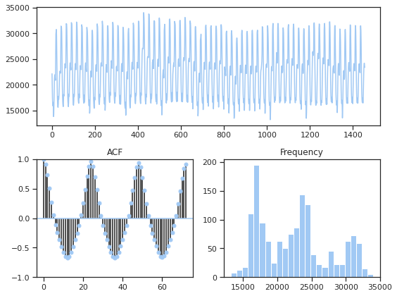
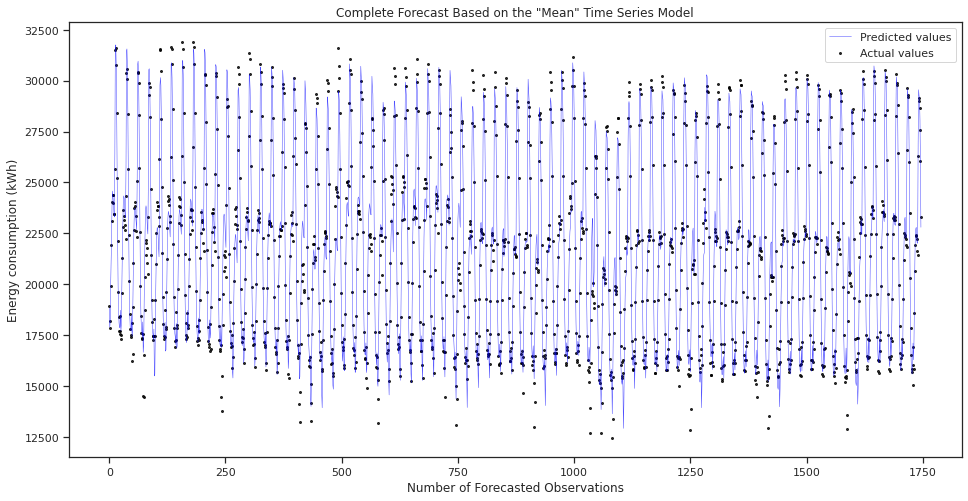

```{r setup, include=FALSE}
knitr::opts_chunk$set(echo = FALSE)
# Load dependencies 
library(reticulate) # For rendering Python code 

```

## Introduction

Machine Learning has become a key tool for modeling energy consumption. Well-constructed ML models can provide accurate forecasts that can then be used to improve the performance of electric systems by reducing the amount of production surpluses and energy shortages. The economic benefits can be significant, as these models can help prevent energy blackouts and reduce wasteful overproduction, cutting costs (for producers, consumers, and States in general) and contributing towards a more sustainable future. 

However, **one of the most pressing difficulties with consumption forecasting is the time dependency of the data**. In time series data, each observation depends on the previous one(s). In mathematical terms, time series data is not independent and identically distributed ($i.i.d$) because the underlying generating process is not stochastic, one of the basic assumptions for regression models. This dependency can generate trends that, if left untreated, can create issues in traditional estimation approaches, including machine learning models because it is very easy for the learning algorithms to reproduce the trend of previous data points instead of finding a function of the target based on the covariates. 

In our project "Time Series Forecasting on Energy Consumption", we evaluated the performance of five different machine learning models in a consumption forecasting task after accounting for the time dependency of the data. The main objective was to compare the accuracy of our models when predicting energy consumption in Tetouan, Morocco during 2017 based on weather conditions as well as temporal variables. To do so, we used a classical time series ARIMA model as a baseline, and then evaluated the performance of various standard machine learning models: Gradient Boosting, ExtraTrees, Support Vector Machines (SVM), and Auto ML framework AutoGluon developed by Amazon. We developed all of our models in Python, primarily using the numPy, matplotlib, pandas, pmdarima, SciKitLearn, and Autogluon packages and only our local machines to access Google's cloud servers.

This task was also done in the paper \"Comparison of machine learning algorithms for the power consumption prediction:case study of Tetouan city\" [@salam2018comparison]. However, by design, we chose different models and approaches. More importantly, the previous paper does not explicitly account for the time-series nature of the data, which is one of the challenges we dealt with in our exploration.

In this article we will walk you through our main findings from the project. For more details on our work, you can visit our Github repo[^1] and read our final report. 


## First things first: an overview of the data.
The data set was originally derived from a study conducted at the Abdelmalek Essaadi University in Morocco in 2018 [@salam2018comparison].[^2] It is a very good data set to evaluate machine learning models in time-series forecasting tasks because it is labelled data set, has no missing values, and has a multivariate time series structure. 

The power consumption of Tetouan is divided into three source stations: Quods, Smir and Boussafou. Each data point represents the aggregated power consumption in each respective station or zone observed in 10-minute increments, over a 1-year time period from January 1 2017 to December 30 2017. Moreover, for each power consumption observation, the data set includes weather-related observations, including humidity, wind speed, general diffuse flows, and diffuse flows [@salam2018comparison].

```{r fig1, echo = FALSE, message=FALSE, fig.cap="Power Consumption"}
knitr::include_graphics("figures/OverallConsumption.png")
```

Figure \@ref(fig:fig1) visualizes energy consumption for the three zones every 10 minutes over the course of a year. We can already identify some significant seasonal fluctuations in power consumption, with a notable increase during the summer in all three zones (particularly in Zone 3 - Boussafou). This makes sense: Tetouan has a Mediterranean climate with mild temperatures in the winter and high temperatures in the summer. The spike in summer consumption is likely caused by increased use of air conditioning and a general population increase due to summer tourism [@salam2018comparison].

We performed many transformations on the data for our analysis, extracting temporal dummy variables from the original data. Since energy consumption varies highly by time of day in addition to the season, we included variables for days, months, hours, and so on. We also averaged the 10-minute readings into a single hourly observation, and the mean of the three zones into a single composite geographic average, as for our purposes we did not need such a granular approach to the data.

### Stationarity
Stationarity is a key requirement for many estimation methods. In non-stationary time series the mean, variance and auto-correlation structures change over time, a clear indicator of $i.i.d$ assumptions being violated. We cannot expect unbiased estimators and good machine learning predictions, if our models violate key assumptions [@Stationarity].

To check whether our time series is stationary, we calculated the results of the *Augmented Dickey Fuller* (ADFuller) test on our target variable (*MeanConsumption*) , which is a statistical test, part of the *statsmodels* package. The test has a null hypothesis: \"the time series is non-stationary\", which can be rejected if $p-value<0.05$ [@ADFTest].

The results in *Table 1* confirm that the time series in Tetouan is indeed non-stationary, and that this non-stationarity is due to some peaks in the consumption of the summer months (shown also in the second column of our table). 

::: {tab:AdFuller}
  Statistic    Target   SummerMonths   $\Delta$Target
  ----------- -------- -------------- ----------------
  ADF          -2.57       -1.39           -16.26
  p-value      0.0985       0.59       $3.54e^{-29}$

  : Results of the Adfuller test on the target variable.
:::
To make our data stationary, we used differences between observations. The results of the differentiation can also be observed in the third column of *Table 1*: our new time series became stationary! We are ready now to fit and test our machine learning models.

```{r fig10, echo = FALSE, message=FALSE, fig.cap="Stationary Time Series"}
knitr::include_graphics("figures/StationaryTS.png")
```


## Our Approach to Time Series Forecasting (Proposed Method and Experimental details)
As mentioned before, we chose different models and approaches to the original study. The authors of that study predict energy consumption at both 10 minutes and 1 hour intervals, generating three different models per zone of the city. 

Instead, we chose to better account for the time dependency of our data to get a clearer sense of ML's performance in time series forecasting problems. Since the data is not IID, we adjusted for its temporal nature by using an ARIMA model as a baseline and differencing the target variable to make the data stationary before fitting our models: ExtraTrees, SVM, Gradient Boosting, and AutoGluon. 

In the following section we briefly explain the models we used. Feel free to skip it if you feel you are already familiar with them.


### Baseline - ARIMA model

Accounting for time series data is typically done by using ARIMA models. We chose this model due to the additional seasonal daily lags (24-hour increments) that are captured by the Moving Average (MA) lags used by them. The underlying estimation process is maximum likelihood estimation and indeed, this drastically increases the computational runtime. 

Ultimately, among the various ARIMA models, the optimal time series model for our data is a Seasonal Auto Regressive Integrated Moving Average eXogenous (SARIMAX) model. This subclass of ARIMA also includes seasonality lags as well as differencing the time series first observations. 

In determining the baseline model, we used the pmdarima package, and primarily its auto_arima function. This function automates all of the necessary data transformations, as carried out manually for the other models above, and then proceeds to algorithmically determine the optimal ARIMA model. 

#### ARIMA Model's Experimental Details
A key difference in the implementation between the ARIMA baseline model and the other ML models we considered was the test-training split. Auto_arima, which uses scikitLearn's TimeSeriesSplit, splits the data into several sets of chronologically ordered training and testing data, retaining the time series element. As the auto_arima function runs, the training sets updates in a rolling manner until the last test set is reached. This is then used as the validation set and the model forecast on this validation set is used as our comparison measure.

The pm.utils.tsdisplay() function returns the following three visualisations. Figure \@ref(fig:fig2) below shows the desirable stationarity of our power consumption data after taking the first difference.The ACF plot indicates the strong seasonal component of the data series which informed the choice of including seasonal lags in our ARIMA model.

```{r fig2,  echo = FALSE, out.width = '100%', fig.cap="Top: Plotting the Differenced Data. Bottom Left: ACF plot. Bottom Right: Histogram" }


```

In order to determine this optimal model, the auto_arima function performs a step-wise procedure across various model specifications and determines the best model from four different specifications to start with. 

Out of these four, the best model is chosen according to the lowest *Akaike Information Criterion*. The other models are then updated in a stepwise adjustment of the parameters with respect to current best model, AICs are recomputed and compared again and the new best model gets updated. This iterative process is repeated until no model with a lower AIC can be found and a threshold is reached. This is another feature than can be tuned by the user, among the many parameters and choices the user makes.

### Machine Learning Models Architecture

Our data set includes labels for Mean Power Consumption. We therefore used supervised learning models for our prediction task: 

-   *Extra Trees* or *Extremely Randomized Trees* are an improvement of Decision Trees. Like Random Forests, Extra Trees combine the predictions of many trees into a single prediction, by choosing the best split between the subsets of features. Unlike Random Forests,Extra Trees randomize both attributes and cut-points in the node splitting process (thus reducing variance), and use the whole data set for the training process (reducing bias) [@geurts2006extremely]. They end up having similar performance to Random Forests, but through a simpler and faster algorithm [@ExtraVsRandom].

-   *Support Vector Machines* are versatile Machine Learning models that work by finding the largest possible margin that separates  \"classes\" of instances on a given space. SVM Regression (or SVR) models use these margins to fit as many possible instances, while minimizing the prediction error [@geron2019hands]. 

-   *Gradient Boosting* is an algorithm that boosts weak learners into strong learners. The Boosting training process is a tandem approach where the weak learners are trained sequentially, with each weak learner learning from the previous one and eventually combining the predictions of all the learners to produce the final prediction. It has relatively fast training times, as well as high performance. 

#### ML Model's Experimental Details
As usually happens on ML projects, we split the training set, validation set and test set in a ratio of 6:2:2. Since the data is based on time-series, this separation was chronological rather than random (if we did the usual train/test splitting, we would risk having future observations predicting past observations). Our validation and testing sets correspond then to the 40% of the newest observations so that the training is done in the earliest part of the time-series and the predictions on the subsequent observations.

```{r fig3,  echo = FALSE, out.width = '100%', fig.cap="Set splitting into training, validation and testing sets." }
knitr::include_graphics("figures/split.png")
```

We then calculated the difference between the target variable at time $t$ and at time $t-1$. This differentiation allowed us to have a stationary data set, as can be seen in Table1.

For more accurate predictions, we added 1-hour, 2-hour and 24-hour lagged differences to the weather and seasonality covariates. These time lags were chosen as they minimized the ARIMA model's AIC. Whilst the function also determines the relevant MA lags, it is becomes very complicated to compute these manually, so we exclusively included AR lags in the remainder of the ML models we test.

For SVM, ExtraTrees and Gradient Boosting models, we initially trained them with default settings and applied them on the validation sets. Then we compared their performances based on their evaluation metrics. After that we did the fine-tuning process to find the best model parameters with GridSearchSV function for those models. 

Table 3 shows the optimal parameters that we used for our testing set prediction. 

::: {#tab:OptimalParameters}
  Model                  Fine-tuning     Training time
  ------------------- ----------------- ---------------
  ExtraTrees            max_depth=11         2.3s
                       n_estimators=20  
                        min_split=60    
  SVM                      C=1000            2.78s
                        gamma= 0.0001   
  Gradient Boosting      max_depth=3          2s
                       n_estimators=60  
                        min_split=80    

  : Model configurations after running GridSearch for parameter
  tuning.
:::

### AutoML model-Autogluon
Autogluon is an open-source framework that enables easy-to-use and easy-to-extend machine learning approaches developed by Amazon [@ge2020analysis]. It only needs a few lines of simple and elegant code to prototype multiple classical machine learning models, leveraging automatic hyperparameter tuning and stacking them in multiple layers for comparison. AutoGluon enables users to utilize state-of-the-art techniques without expert knowledge and conduct significant gains in accuracy and time-efficiency [@AutoGluon-Tabular2020].


## Evaluation methods
Evaluating the accuracy of different machine learning models is an essential part of an ML project, as it provides common metrics for comparing and optimizing model selection. We used three main metrics: R Squared ($R^{2}$), Mean Squared Error (MSE) / Root Mean Squared Error (RMSE)[^3], and Mean Absolute Error (MAE). All these metrics are summarized in the table below. They indicate the difference between our predicted values  ($\hat{y}^{(i)}$) and the actual values, and can be calculated by using different functions from scikit-learn library. 

::: {#tab:EvaluationMetrics}
  Metric    Formula                                                                                 
  -------   ------------------------------------------------------------------------------------ 
  $R^{2}$   $1-\frac{\sum_{i=1}(\hat{y}^{(i)}-y^{(i)})^{2}}{\sum_{i=1}^{m}(y^{(i)}-\bar{y})^{2}}$
  $MSE$     $\frac{1}{m}\sum_{i=1}^{m}(\hat{y}^{(i)}-y^{(i)})^{2}$ 
  $MAE$     $\frac{1}{m}\sum_{i=1}^{m}\lvert{\hat{y}^{(i)}-y^{(i)}}\rvert.$
  
  : Evaluation 
  metrics,
:::

$R^{2}$ or the *coefficient of determination* provides a measure of how well we can explain the variance in the dependent variable from the variance of other predictors. In the formula, $\bar{y}$ corresponds to the mean of observed values. $R^{2}$ is an intuitive measure of error for regression problems because a measure of 1 means the model captures all variance of the dependent variable, while lower values indicate relative worse model fit.

However, many advise against over-relying on this measure to test the performance of Machine Learning algorithms in time-series forecasting. The $R^{2}$ value for a time series model could seemingly indicate high accuracy, but can be caused by the auto-correlation due to time-dependency, as successive observations are intrinsically related to each other [@pierce]. For this reason, we did not report $R^2$ values for our ARIMA models; because it is a standard practice, we provided it for the other models, although it wasn't our main comparative measure, MSE/RMSE was. It is worth noting that in time-series analytics a smaller RMSE indicates better results [@amirkhalili2020comparison].

## Some Results
The table below shows the accuracy and error measures for the baseline and other models we trained in the experimental phase of the project. 

::: {#tab:Results}
| Model              | $R^{2}$ | RMSE    | MSE        | MAE     |
|--------------------|---------|---------|------------|---------|
| Naive ARMA         | /       | 1152.50 | 1328259.10 | 760.19  |
| Mean SARIMAX       | /       | 966.15  | 933447.24  | 669.56  |
| Composite SARIMAX  | /       | 975.38  | 951366.01  | 681.46  |
| ExtraTrees         | 0.97    | 340.57  | 115990.42  | 241.32  |
| SVM                | 0.09    | 1749.24 | 3059843.46 | 1246.14 |
| GradBoosting       | 0.96    | 348.45  | 121420.78  | 245.48  |

  : Model configurations after running GridSearch for parameter
  tuning.
:::

### What do these results mean? Comments on the quantitative results.

-   **ARIMA** 
As soon as the auto_arima parameters are defined and the code is running, there is little the user can still adjust. Rather than trying to manually recompute the auto_arima processs, we decided to let this code run three times, with different consumption aggregation methods. 
- 1. The "Naïve" forecast, which predicts the mean consumption of Tetouan City purely based on the power consumption 24-hours ago, a simple AR(24) model. We chose this as our simple forecast since the data exploration highlighted the importance of the daily lag.
- 2. the "Mean" forecast, which lets auto_arima determine the number of optimal lags across various classes of ARMA models.
- 3. the last forecast has been denoted the "Composite" forecast, first each Zone's individual power consumption is predicted using auto_arima, and then the total Mean Consumption is computed as the mean across the three zone's forecast. The visualisation of only the Mean forecast (only for the forecasted time period) is plotted below in \@ref(fig:fig4) below.

```{r fig4,  echo = FALSE, out.width = '100%', fig.cap="Mean Consumption forecast only for the forecast horizon." }

```
    
-   **SVR** Even with the optimal configurations resulting from the grid search algorithm, our SVR model underfits the power consumption stationary time series. The error rates that we obtained when testing the model are high (an error of almost $1750$, the RMSE, is considerable given that the differentiated means range between -5269 and 8193 KWh) - see Results table for more.
Figure \@ref(fig:fig5) shows that the prediction values seem to pick up the oscillation trend of the time series, but not the extent of its variation along the 'y' axis.

```{r fig5,  echo = FALSE, out.width = '100%', fig.cap="Predicted vs actual values for optimal SVR ." }

```

-   **ExtraTrees & GradientBoosting** The RMSE of both ExtraTrees & Gradient Boosting is around 340 after fine-tuning. They performed slightly worse on the testing set than on the validation set, as expected. It proves that both of them are very stable and suitable for dealing with time series forecasting problems.

```{r fig6,  echo = FALSE, out.width = '100%', fig.cap="Predicted vs actual values for optimal ExtraTrees and Gradient Boosting."}
knitr::include_graphics("figures/ET_final.png")


```

-   **AutoGluon**  The Autogluon leader-board below shows per-model performance based on details such as MSE, training time, and so on The leader-board shows 12 ML models in total and ranks these models according to how well they perform.

```{r fig7,  echo = FALSE, out.width = '100%', fig.cap="Leaderboard of AutoGluon." }
knitr::include_graphics("figures/Auto.png")
```

## Analysis 

Generally speaking, all three results from the baseline ARIMA time series models capture the variance in the dependent variable rather well - in spite of adding no further explanatory variables and purely relying on the lags, seasonality, and moving averages. The regression analysis output in the Appendix show that all of the lag terms determined by auto_arima are statistically significant with p-values of 0. The intuition is sound too: the power consumption of today primarily depends on the power consumption an hour ago, two hours ago, and yesterday. The difference this 24-hour, seasonality lag makes is indicated by figure \@ref(fig:fig8) down below. The fact that the Naive forecast performed worst across the three models was hardly surprising; as we include additional, more relevant lags, the models' forecasting ability improves. The expectation was that the composite forecast would
outperform the mean as the model would be able to adapt to each Zone individually first. However, despite this not being the case, all performance measures we computed are very close to each other in magnitude.

```{r fig8, echo = FALSE, out.width = '100%', fig.cap="Search model without (m =1) vs. with (m=24) seasonality." }
knitr::include_graphics("figures/Seasonality_plot.png")
```

As for the SVR model, despite the optimization process, its performance was the worst of all the studied models: the RMSE was the highest of all models, but the predictions didn't reach the full amplitude of the labels in our dataset. However, this is not so surprising. A plausible explanation might be that SVM tend to do better with scaled data [@amirkhalili2020comparison] (which stabilizes both the mean and variance). The process we performed to make the time-series stationary, stabilized only the mean but not the variance (something we decided on so as not to lose the variations that we wanted to be able to predict).This might explain why our SVR model was \"blind\" to the high peaks of the hourly differences in power consumption.

However, ExtraTrees and Gradient Boosting models performed quite well on validation sets and testing sets. In terms of the characteristics of these algorithms, ExtraTrees and GradientBoosting belong to ensemble learning that can often achieve significantly better generalisation performance than a single learner by combining multiple learners. From the results of testing sets (both of their RMSE are around 340), they are very robust even in the face of a lot of outliers and time series data.

From the AutoGluon leaderboard (Figure 4), we found that half of the models performed as good as fine-tuned ExtraTrees and GradientBoosting models on the testing set, however the other models performed very generally. Decision trees and boosting techniques have better performance but KNeighbors techniques are not very good.

## Conclusions

Our main achievement is that we successfully implemented the time-series nature of our data not only into our baseline model but also included some lag elements in our standard machine learning algorithms. Arguably this is the main result of the paper as can be seen from the ARIMA models: the auto-regressive time aspect is reflected in the forecast plots of the baseline model. The next step was to consider whether an additional selection of potential covariates would further improve forecasts. That said, the best model seems to be the Extra trees with an even more improved RMSE of 340.57. 

We hoped for more from the SVR's models. However, it was not surprising that they performed very poorly. Since SVR finds the narrowest tube around high-dimensional surfaces, the high variation of our data causes more deviations to be there included and thus makes the error higher. A new study could try using the SVR's as part of an ensemble of learners. Because of the advantages of ensemble learning (better generalisation and robustness), we observe that they performed very well and robustly even with time series data.

The most important meaning of AutoGluon is that we can utilize state-of-the-art techniques through a few lines of code and without expert knowledge. This tool eases the process of implementing improvements/tweaks to bespoke models, and is a powerful opportunity to welcome newcomers to the field of ML. In addition, AutoGluon could also be used in text prediction, object detection and image prediction fields, which has great potential to be explored.

Although we believe our exploration was a successful attempt at understanding the advantages and shortcoming of different machine learning algorithms in a time-series prediction task, our study still has some limitations. We did not account for the seasonality, calendar variation patterns and moving means in the ML models, while the ARIMA model did. In a future study, we could further explore the SARIMAX potential for these issues, as well as the introduction of other variables that can account for them in the covariate matrix for all the machine learning models.


[^1]: Here is the link to our GitHub repository
    <https://github.com/zeitgeist-hash/GRAD-C24-Machine-Learning.git>
[^2]: It can also be found at the University of California, School of Information and Computer Science's online Machine Learning
repository [@DataSet]. 
[^3]:RMSE is the square root of the MSE.